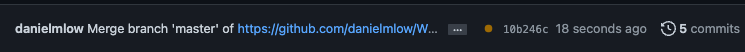

# WellBeingStudy


Code to run the MIT Month of Wellness Challenge protocol using Reproschema.


# Clone this repo 

Or create a new repo with a different name on github.com/your_username

Then also edit `githubSrc` and `assetsPublicPath` in `.ui-changes/src/config.js` to this repo.

Once you've changed the paths to your new repo, you will commit and push. There is a workflow that will do a jsonlint on your scripts. This will take a few minutes. If there is no error, it will deploy and you'll see a green tick instead of a yellow circle:



Go to setting and enable gh-pages:  


# Instructions for making edits
* To quickly test you can go here: 


    [https://www.repronim.org/reproschema-ui/#/?url=https://raw.githubusercontent.com/danielmlow/WellBeingStudy_daily/master/protocol/WellBeing_schema](https://www.repronim.org/reproschema-ui/#/?url=https://raw.githubusercontent.com/danielmlow/WellBeingStudy_daily/master/protocol/WellBeing_schema) 
    
    or replace your username and repo accordingly.


* To properly test, for each commit, a github action will test the JSONLD code. to know where the error is, you can run the commands in subdirectories.

    ```
    python -m pip install --upgrade pip setuptools
    pip install reproschema requests_cache
    
    reproschema -l DEBUG validate activities
    reproschema -l DEBUG validate protocol/WellBeing_schema
    ```

 


* To display images, click on the image, click on "raw" and copy the URL into the file (e.g., the README-en.md for the landing page). 
    In Markdown: 
    
    `` 
    
    
    
When referencing to reproschema-library use the latest commit number


Use the following values for these item responses:
```
            {
                "value": 0,
                "name": "Prefer not to disclose"
            },
            {
                "value": -1,
                "name": "Other"
            },
             {
                "value": 999,
                "name": "None"
             }

```
    


use `clinical_history_psychiatry.includes(-1)` instead of `===` since it is a multiple choice

and use `!clinical_history_psychiatry.includes(-1)` which starts with `!` to show item if it is false. 


add a break line with html: `One line <br>Next line`


### Tests

* Make sure there are no repeated values in radio items.
* perhaps use integer for radio items instead of string. 
* `variableName` is not always needed. Only when re-referencing it to use isVis for instance.
* 
